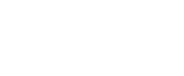
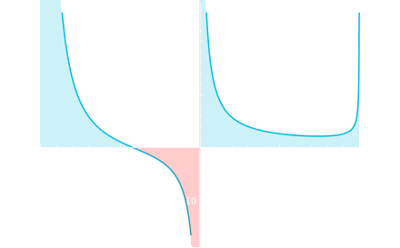

# Simple script to use the wolfram alpha api to solve natual language questions
## Installation
get [python](https://python.org/downloads) (i used 3.10.9)

in cmd
```bash
git clone https://github.com/Hecker5556/wolfram-api
```
```bash
cd wolfram-api
```
```bash
pip install -r requirements.txt
```

## Usage
cmd

```
usage: wolfram-api.py [-h] [--theme THEME] [--timeout TIMEOUT] question

positional arguments:
  question              mathematical equation using natural syntax

options:
  -h, --help            show this help message and exit
  --theme THEME, -th THEME
                        what theme to use for images - light, dark
  --timeout TIMEOUT, -t TIMEOUT
                        how long to wait for an answer from wolfram (the harder the question the longer you should set the timeout)
```

in python

```python
#assuming wolfram-api.py is in sys path
from wolfram-api import wolfram_api
import asyncio
wolfram = wolfram_api()

#non async function
results = asyncio.run(wolfram.natural_language("x^2 + 6x - 2 = 0"))

#async function

async def main():
    results = await wolfram.natural_langugae("x^2 + 6x - 2 = 0")

images = results.get("filenames")
solution1 = results.get("Solution-1")
print(solution1)
```


Example images from wolfram using dark theme

input: 

`integral -1 to 1 of (1/x)*(sqrt((1+x)/(1-x))*(1+2x-x^2)/(1+2x+x^2)`



visual representation

